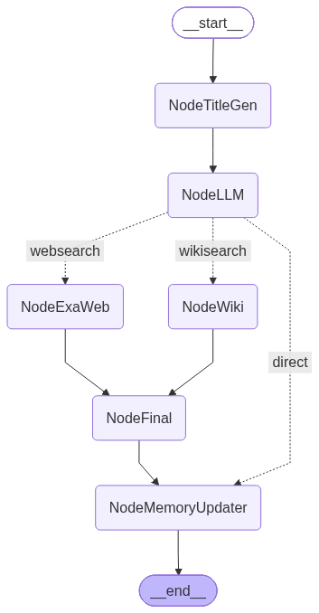
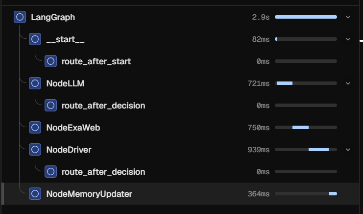

# 🔍 SearchAgent-B — A LangGraph-Powered Multi-Tool Research Agent

> **Looking for the product experience?** Explore the [SearchAgent frontend](https://github.com/varshil009/SearchAgent-F) — a React-based real-time chat interface for this research agent.

<p align="center">
  
</p>

<p align="center">
  <i>The compiled state graph — 8 nodes connected by conditional edges, orchestrated through LangGraph's cyclic execution model.</i>
</p>

---

## 📋 Overview

**SearchAgent-B** is a production-grade, LLM-driven research assistant built on **LangGraph's state graph framework**. It doesn't just call an LLM once — it enters a **cyclic reasoning loop** where an agentic decision node (NodeDriver) dynamically chooses whether to answer the user, search the web, query Wikipedia, execute sandboxed Python code, or retry with a backup. This is **tool-augmented reasoning** in practice, not a linear pipeline.

The agent maintains **per-thread conversation state via MemorySaver checkpointing**, streams real-time status updates over **WebSocket**, and generates **conversation titles** automatically. Each decision is bounded by guards against infinite loops, identical tool repetition, and oversized context windows.

---

## 🧠 Architecture — The Execution Graph

At the core of SearchAgent-B is a `StateGraph` from LangGraph. The state (`AgentState`) extends `MessagesState` with custom fields for tool results, execution history, image links, status messages, and more — all with **annotated reducers** for clean merge semantics across nodes.

The graph PNG above visualizes the complete topology. A **NodeBackup** node exists as a safety net — when the decision node fails or returns invalid output, the backup generates a best-effort answer using available context.

---

## 🔧 Key Engineering Decisions

### 1. Structured LLM Output Contract

Rather than relying on fragile JSON mode or function-calling schemas, every LLM call in the graph strictly adheres to an XML-based output contract:

```xml
<!-- Final answer (terminal) -->
<final>
  Markdown response for the user
</final>

<!-- Tool invocation (non-terminal) -->
<tool>
  {"tool_required": true, "tool": "websearch|wikisearch|node_python", "tool_query": "..."}
</tool>
```

Parsed via `re.fullmatch` — no surrounding text, no markdown wrappers, no ambiguity. If neither tag is matched, the graph routes to the **backup node** for graceful degradation.

### 2. Sandboxed Python Execution with AST Whitelist

The `NodePython` node runs user-generated Python code with **multi-layered isolation**:

| Layer | Protection |
|-------|-----------|
| **AST analysis** | Statically rejects imports, function/class definitions, try/except, while loops, lambdas, with blocks, async constructs, deletions |
| **Name whitelist** | Blocks `__import__`, `eval`, `exec`, `compile`, `open`, `getattr`, `setattr`, `breakpoint`, `help`, etc. |
| **Attribute whitelist** | Blocks `.system`, `.popen`, `.run`, `.environ`, `.__dunder__` access |
| **Worker process isolation** | Code exceeding a single `result = expression` runs in a `multiprocessing.Process` with a **15-second timeout** |
| **Safe builtins** | Only arithmetic, collection, and type-conversion functions exposed |

```python
# Allowed: one-line expression
result = sum(x["value"] for x in last_tool_result if x["status"] == "active")

# Rejected by AST validator
import os  # Import forbidden
os.system("rm -rf /")  # Would never reach this point
```

### 3. Cyclic Loop Guards

A cyclic graph can loop indefinitely if the LLM keeps requesting tools. Three independent guards prevent this:

- **Max 5 consecutive identical tool calls** (`_consecutive_count`) — forces `loop_blocked = True`, which instructs the LLM to produce a final answer
- **Max 20 total tool executions** (`MAX_TOOL_EXECUTIONS`) — routes to backup if exceeded
- **`loop_blocked` flag** — propagates through state, modifies the decision prompt to force a `<final>` answer

### 4. Token-Efficient Tool Result Handling

Large search results can blow past context windows. Two strategies keep the prompt lean:

- **Content truncation**: Web search results are capped at 120-word summaries, 3 highlights of 40 words each; Wikipedia articles at 100 words
- **Schema descriptor**: Results exceeding 12,000 characters are replaced by a **recursive structural description** that shows types and shapes without the data itself — the LLM decides if it needs to use `node_python` for computation over the large result

```python
# describe_tool_result output example:
# list[3] of dict {title: str, published_date: str, author: str, summary: str, highlights: list[str]}
```

### 5. Per-Thread Memory Persistence

Each conversation thread gets its own `MemorySaver` checkpointer via a `dict[thread_id, MemorySaver]`. The `NodeMemoryUpdater` runs at the end of every graph invocation, condensing the last 6 messages into a running summary that persists across sessions.

```
Thread A ── MemorySaver(A) ── Summary: "User researching AI agents, prefers concise answers"
Thread B ── MemorySaver(B) ── Summary: "User analyzing stock market trends, wants data tables"
```

### 6. Real-Time Streaming over WebSocket

The `/ws/query` endpoint streams graph updates as they happen using LangGraph's `stream_mode="updates"`:

```json
// Status update from a node
{"type": "status", "status": "searching web"}

// Image links discovered during search
{"type": "images", "image_links": ["https://..."]}

// Incremental response tokens
{"type": "response", "response": "The result shows that..."}

// Conversation summary (end of run)
{"type": "summary", "summary": "User asked about..."}

// Auto-generated conversation title
{"type": "title_suggestion", "title": "AI Safety Research 2024"}
```

### 7. Arize Phoenix Observability

The graph is instrumented with **Arize Phoenix** for local tracing and LLM observability — every node execution, LLM call latency, and token usage is captured:

<p align="center">
  
</p>

<p align="center">
  <i>Phoenix trace treechart — each span represents a node execution during one graph invocation, with full timing and LLM metadata.</i>
</p>

```python
from phoenix.otel import register
tracer_provider = register(project_name="local-search-chatbot", auto_instrument=True)
```

---

## 📁 Project Structure

```
SearchAgent-B/
├── main.py                        # FastAPI entry point (REST + WebSocket)
├── agent_loop.py                  # Graph compilation with per-thread MemorySaver
├── generate_graph_viz.py          # PNG visualization generator
├── agent_graph.png                # Visual graph (embedded above)
├── .gitignore
├── routes/
│   └── __init__.py                # Extensible API route blueprints
├── services/
│   ├── groq.py                    # Groq LLM client
│   ├── exa.py                     # Exa web search client
│   ├── wikipedia.py               # Wikipedia API client
│   ├── supabase.py                # Supabase client (persistence layer)
│   └── app_logger.py              # Structured file logger
└── graph/
    ├── main.py                    # Graph topology (8 nodes, conditional edges)
    ├── agent_state.py             # Typed state schema with reducers
    ├── node_llm.py                # Initial LLM decision node
    ├── node_driver.py             # Cyclic decision node (driver)
    ├── node_websearch.py          # Exa-powered web search
    ├── node_wiki.py               # Wikipedia search
    ├── node_python.py             # Sandboxed Python execution
    ├── node_memory_updater.py     # Conversation summarization
    ├── node_title_gen.py          # Auto-title generation
    ├── node_backup.py             # Graceful degradation fallback
    ├── tool_result_schema.py      # Recursive result schema descriptor
    ├── instrumentation.py         # Arize Phoenix observability
    ├── tools.json                 # Tool registry schema
    └── tool_request.json          # Tool request format spec
```

---

## 🚀 Quick Start

### Prerequisites

- Python 3.10+
- API keys for **Groq** and **Exa**

### Setup

```bash
# Clone and enter the project
cd SearchAgent-B

# Create .env
echo "GROQ_API_KEY=your_key_here" >> .env
echo "GROQ_MODEL=llama-3.3-70b-versatile" >> .env
echo "EXA_API_KEY=your_key_here" >> .env

# Install dependencies
uv sync

# Run the backend
uvicorn main:app --host 127.0.0.1 --port 8000 --reload
```

### Generate Graph Visualization

```bash
python -m graph.generate_graph_viz
# Output: agent_graph.png
```

---

## 🌐 API

### `GET /health`
```json
{"status": "ok"}
```

### `POST /query`
```json
{
  "query": "What are the latest developments in LLM agents?"
}

// Response
{
  "response": "Recent developments include...",
  "statuses": ["generating", "searching web", "complete"],
  "image_links": ["https://example.com/image.png"]
}
```

### `WebSocket /ws/query`
```json
// Client → Server
{
  "query": "Explain transformer attention mechanisms",
  "thread_id": "a1b2c3d4-e5f6-...",
  "summary": "Previous conversation context...",
  "convo_title": "Transformer Deep Dive",
  "history": [{"role": "user", "content": "..."}, ...]
}

// Server → Client (streamed updates)
{"type": "connection", "status": "connected"}
{"type": "status", "status": "generating"}
{"type": "status", "status": "searching web"}
{"type": "images", "image_links": ["..."]}
{"type": "response", "response": "The attention mechanism..."}
{"type": "summary", "summary": "User asked about transformers..."}
{"type": "title_suggestion", "title": "Transformer Attention Explained"}
```

---

## 🛠️ Tech Stack

| Component | Technology |
|-----------|-----------|
| **Graph framework** | LangGraph (StateGraph, cyclic execution, MemorySaver) |
| **LLM** | Groq (via `groq` Python SDK) |
| **Web search** | Exa API |
| **Encyclopedia search** | Wikipedia API |
| **API layer** | FastAPI (REST + WebSocket) |
| **Streaming** | LangGraph `stream_mode="updates"` + WebSocket |
| **Observability** | Arize Phoenix (OpenTelemetry) |
| **Serialization** | Pydantic (request/response validation) |
| **Execution sandbox** | AST analysis + multiprocessing isolation |
| **CORS** | FastAPI CORSMiddleware (local dev: `localhost:5173`) |

---

## 💡 Why This Matters

SearchAgent-B demonstrates **how to build reliable LLM agents in production**. It's not a toy demo that calls an LLM once and formats the output. It solves real problems:

- **How do you prevent infinite agent loops?** → Guardrails with thresholds and a `loop_blocked` circuit breaker
- **How do you keep the LLM's context window under control?** → Structural truncation and recursive schema summarization
- **How do you execute LLM-generated code safely?** → Multi-layer sandbox with AST validation, process isolation, and timeout
- **How do you maintain conversation state across sessions?** → Per-thread checkpointing with LLM-generated summaries
- **How do you give users real-time feedback?** → WebSocket streaming of per-node status updates
- **How do you build for failure?** → Backup node, graceful degradation, structured error responses

---

<p align="center">
  <b>Built with LangGraph, Groq, Exa, FastAPI, and Python</b>
  <br/>
  <i>Connect with me on <a href="https://github.com">GitHub</a> · <a href="https://linkedin.com">LinkedIn</a></i>
</p>
